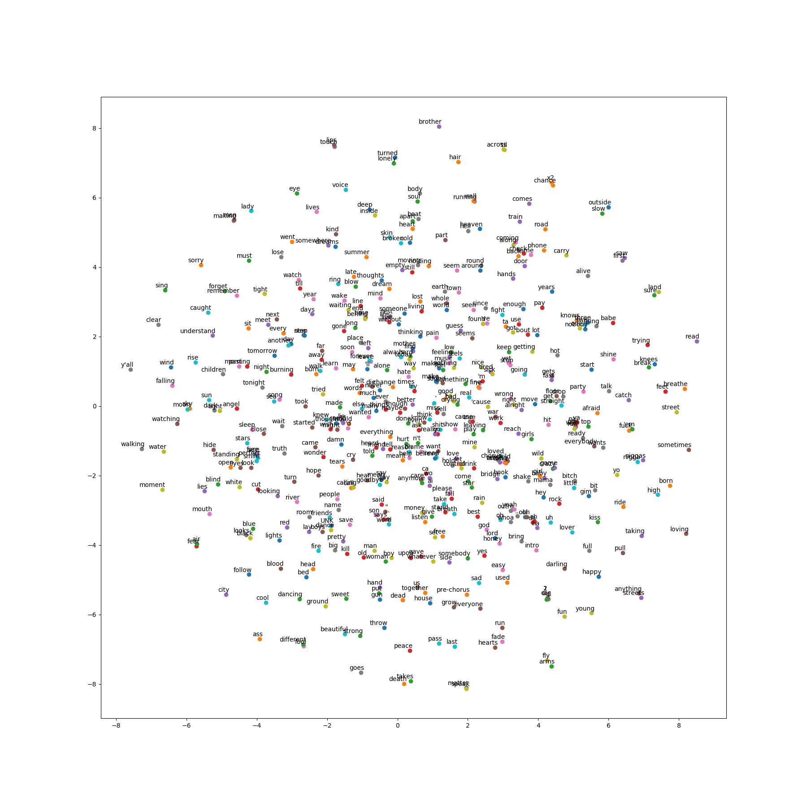

# W266 Group Project: Lyric Mood Classification

UC Berkeley Masters of Information &amp; Data Science

W266 Natural Language Processing with Deep Learning Group Project

Team: Cyprian Gascoigne, Jack Workman, Yuchen Zhang

### Table of Contents

[Project Proposal](#project-proposal) 
[Dataset](#dataset) 
[Results](#results) 
[Python Environment Setup](#python-environment-setup) 
[Project Procedure & Walkthrough](#project-procedure-and-walkthrough) 
[Appendix](#appendix) 

## Project Proposal
<a name="project-proposal"/>

https://docs.google.com/document/d/1ofGlfFS2aUMOvsI7ZhUnTVFt6m2Gls2x_Sw_QMRh3vI/edit

Live Session Instructor: Daniel Cer
Group Members: Jack Workman, Yuchen Zhang, Cyprian Gascoigne

We plan to compare the accuracy of deep learning vs traditional machine learning approaches for classifying the mood of songs, using lyrics as features. We will use mood categories derived from Russell’s model of affect (from psychology, where mood is represented by vector in 2D valence-arousal space) and also calculate a valence-happiness rating. Mood categories will likely be happiness, anger, fear, sadness, and love (perhaps surprise, disgust).

We will test the extensibility of our deep learning model through genre classification, song quality prediction / album ratings, and additional text features such as part-of-speech tags, number of unique and repeated words and lines, lines ending with same words, etc.

Classifying mood (or “sentiment”) using textual features has been studied less than musical features. One reason may be in obtaining a large dataset legally (as lyrics are copyrighted material). The dataset we will use is the Million Song Dataset (MSD), a freely available million contemporary music track dataset. From MSD, we will use the Last.fm and musiXmatch datasets for song tags and lyrics. We will also use language detection to focus on English lyrics.

Algorithms we are considering in addition to RNN can be naive bayes, KNN, binary SVM, n-gram models like topK.

Previous work reached contradictory conclusion and employed smaller datasets and simpler methodology like td-idf weighted bag-of-words to derive unigrams, fuzzy clustering, and linear regression. Our proposed model approach (RNN) should have better accuracy.

Mood classification of lyrics can help in the creation of automatic playlists, a music search engine, labeling for digital music libraries, and other recommendation systems.

Paper References:
- Bandyopadhyay, Sivaji, Das, Dipankar, & Patra, Braja Gopal. (2015). Mood Classification of Hindi Songs based on Lyrics.
- Becker, Maria, Frank, Anette, Nastase, Vivi, Palmer, Alexis, and Staniek, Michael. (2017). Classifying Semantic Clause Types: Modeling Context and Genre Characteristics with Recurrent Neural Networks and Attention.
- Corona, Humberto & O’Mahony, Michael. (2015). An Exploration of Mood Classification in the Million Songs Dataset.
- Danforth, Christopher M. & Dodds, Peter Sheridan. (2009). Measuring the Happiness of Large-Scale Written Expression: Songs, Blogs, and Presidents
- Fell, Michael & Sporleder, Caroline. (2014). Lyrics-based Analysis and Classification of Music.
- Lee, Won-Sook & Yang, Dan. (2010). Music Emotion Identification from Lyrics
- Mihalcea, Rada & Strapparava, Carlo. (2012). Lyrics, Music, and Emotions.

**Update:** We used a Convolutional Neural Network (CNN) as our mood classification model with word2vec generated embeddings instead of n Recurrent Neural Network (or its variants) because of the size of the input. We had hoped to acquire the song lyrics labeled with moods line-by-line, but we had to adjust our plans when we discovered that the song-to-mood mapping is one-to-one in the MSD+LastFM dataset as we were advised it would prove impractical to train an RNN with such long input sequences. We baselined our classifier with most-common-case, Naive Bayes (NB), and Support Vector Machines (SVM) models and spent the majority of our time tuning our CNN's hyperparameters and the word2vec embeddings along with plenty of effort invested in grooming and cleaning the data.

## Dataset
<a name="dataset"/>

For our project, we made use of the Million Song Dataset (MSD) and its companion datasets from Last.fm and MusixMatch. We also scraped and downloaded lyrics from the internet as MusiXmatch only provides lyrics in a bag-of-words format and we needed the sequential ordering of the lyrics.

Here are the datasets:
- [Million Song Dataset (MSD)](https://labrosa.ee.columbia.edu/millionsong/)
- [Last.fm dataset](https://labrosa.ee.columbia.edu/millionsong/lastfm) (component of MSD) maps songs to user "tags" based on Last.fm user input. These tags can be anything from a human emotion to genre to animals. [Here is a list of unique tags]( https://labrosa.ee.columbia.edu/millionsong/sites/default/files/lastfm/lastfm_unique_tags.txt).
- [MusiXmatch dataset](https://labrosa.ee.columbia.edu/millionsong/musixmatch) (component of MSD) is a collection of song lyrics mapped to song in a bag-of-words format

To unzip the .bz2 files in the data dir, use `tar xvjf <file.tar.bz2>` ([source](http://how-to.wikia.com/wiki/How_to_untar_a_tar_file_or_gzip-bz2_tar_file))

## Results
<a name="results"/>

TODO: add link to paper and table with classifier accuracies.

## Python Environment Setup
<a name="python-environment-setup"/>

First, make sure you have Python 3.6+ installed.

Then, run through the following commands:

- `python -m venv .venv_w266_project`
- Windows: `.venv_w266_project\Scripts\activate.bat`
- Linux: `source .venv_w266_project/bin/activate`
- `pip install -r requirements.txt` - this will install all required packages and might take several minutes

### Jupyter Notebooks

Before interacting with Jupyter Notebooks in this repo, please first run the `setup_jupyter.bat` script. This script installs this repo's virtualenv as a kernel available to jupyter. Then, when using a notebook, click on Kernel -> Change Kernel -> .venv_w266_project to begin using our virtualenv's python and its packages.

To set up jupyter notebook on Ubuntu, [use this guide](https://www.digitalocean.com/community/tutorials/how-to-set-up-a-jupyter-notebook-to-run-ipython-on-ubuntu-16-04).

## Project Procedure & Walkthrough
<a name="project-procedure-and-walkthrough"/>

The following sections seek to explain and provide more information on each of the steps taken to building our dataset and classifier. You can treat these sections like a guide and follow along to reproduce our work or you can skip ahead to [The Lyrical Mood Classification Pipeline] which combines (most) of these steps into a configurable pipeline executable with a single command.

Please note that Step 1 can take quite a while. Downloading the original datasets and scraping for lyrics took us several days with 5+ computers. The scripts come with the option to only download or process lyrics for all artists beginning with a specific letter (for example, 'a'). Use that option to speed things up but be warned that your classifier's accuracy will likely be much lower due to the smaller dataset.

Steps:
1. Data Downloading
1. Scraping Lyrics
2. Indexing Lyrics
3. Labeling Lyrics
4. Word Embeddings
5. Mood Classification

**Recommended:** Skip steps 2 and 3 by decompressing [data/labeled_lyrics.tar.bz2](data/labeled_lyrics.tar.bz2). 

And don't forget to review the Appendix for some useful tips and helpful resources.

### Data Downloading

The original MSD and companion datasets are quite large. Too large, in fact, to be stored in the github repo. To download the data, please run script [download_data.py](download_data.py).

Run `python download_data.py`

For more information, please see [download_data.py](download_data.py).

This will download the data into the _data_ directory. This will take several minutes.

**NOTE**: Only the Last.fm sqlite db and the musixmatch matches file are required. The rest of the downloadable via download_data sources are optional and made available in case one wishes to explore the data further.

### Scraping Lyrics

**Important:** We use the python package **lyricsgenius** for retrieving lyrics. The package interfaces with the www.genius.com api for lyric access. In order to use the package, you'll need to create an account and get an api token. This requires providing an "app name" and "app url" to genius. Once you've done so, save your api key to `data/api.txt`.

To start our project, we attempt to download lyrics for all of the songs in MusiXmatch with use of the lyricsgenius python package. For each song, we try all combinations of the MSD song title, MSD artist name, MXM song title, and MXM artist name until we get a successful download. For many songs, no lyrics were found.

Run `python scrape_lyrics.py`

For more information, please see [scrape_lyrics.py](scrape_lyrics.py).

The output of this stage is the directories data/lyrics/json and data/lyrics/txt populated with files containing just lyrics (if .txt) and lyrics plus additional metadata (if .json).  

**USEFUL TIP**: Run `python scrape_lyrics.py -t a & python scrape_lyrics.py -t b` to run in parallel (for artists starting with letter _a_ or _b_). use `fg` to switch between processes so you can quit with ^C.

### Indexing Lyrics

After scraping and downloading lyrics into txt files, we next index the files and perform basic checks on the validity of each. The checks include:

1. Are the lyrics in English?
2. Does a downloaded lyric text file exist?
3. What is the total word count?

Run `python index_lyrics.py`

For more information, please see script [index_lyrics.py](index_lyrics.py).

The output of this stage is a csv (commonly referred to as indexed_lyrics.csv) with track id, track name, track artist, path to track lyrics file in repo, and additional metadata. A pregenerated version of this csv is available at [data/indexed_lyrics.tar.bz2](data/indexed_lyrics.tar.bz2).

### Labeling Lyrics

Once we have a nice index built, we match the lyrics to the mood tags from the last.fm dataset. To do this, we iterate over each row of the index, query the sqlite Last.fm database for all associated tags, then attempt to match tags against our mood categories.

Our mood categories come in two different forms: the original mood categories (the MOOD_CATEGORIES dict in [label_lyrics.py](label_lyrics.py)) and the expanded mood categories (viewable at [mood_categories_expanded.json](mood_categories_expanded.json). When using the expanded categories, substring matching and subsequent filtering is used to match moods. We explain this process more in-depth in our paper (todo provide link).

Run `python label_lyrics.py --expanded-moods`

For more information, please see script [label_lyrics.py](label_lyrics.py).

The output of this stage is a csv (commonly referred to as labeled_lyrics.csv) very similar to indexed_lyrics.csv but with an additional column: mood. A pregenerated version of this csv is available at [data/labeled_lyrics.tar.bz2](data/labeled_lyrics.tar.bz2).

### Word Embeddings

As input to our deep learning CNN classifier, we make use of the word2vec model as defined by [Mikolov et al](https://papers.nips.cc/paper/5021-distributed-representations-of-words-and-phrases-and-their-compositionality.pdf) and the [implementation provided by TensorFlow](https://github.com/tensorflow/tensorflow/blob/master/tensorflow/examples/tutorials/word2vec/word2vec_basic.py) to generate our word embeddings.

The script [lyrics2vec.py](lyrics2vec.py) contains a lyrics2vec python class that saves its embeddings and data as python pickle files. The pickle files can be reused later by classifiers as needed.

An example of the lyrics2vec implementation can be seen in the [lyrics2vec.py](lyrics2vec.py)'s main function as well as the word_embeddings.ipynb notebook.

The lyrics2vec class is later reused in our mood classification workflow to generate embeddings and pass them to our classifier.

### Mood Classification

For the final act, we build and train a Convolutional Neural Network to predict the moods of the songs we labeled with the lyrics we downloaded. Our CNN is modeled after Yoon Kim's [CNN for Sentence Classification](https://arxiv.org/abs/1408.5882) with help from Denny Britz's [useful CNN walkthrough](http://www.wildml.com/2015/12/implementing-a-cnn-for-text-classification-in-tensorflow/).

For model implementation details, please see [lyrics_cnn.py](lyrics_cnn.py).

Since much of the fun in NLP and Deep Learning comes from fiddling with and manipulating your data, we've constructed a configurable pipeline that consists of

* Importing, filtering, and preprocessing the lyrics
* Training word embeddings with lyrics2vec
* Vectorize and split the dataset
* Train the CNN

This pipeline is available via [mood_classification.py](mood_classification.py). With one command (assuming you've downloaded and extracted [data/labeled_lyrics.tar.bz2](data/labeled_lyrics.tar.bz2)), you can generate word embeddings and train a CNN model on our lyrics dataset. The configuration options are numerous. Please review the script's main function for details.

Run `python mood_classification.py`

When executing the model, models, summaries, and other outputs are saved in the logs/tf directory. They are identified by a unique key generated by the model parameters and an additional name provided by you. For example, a model with embedding_size=128, filter_sizes=\[3, 4, 5\], num_filters=128, dropout=0.5, L2=0.01, batch_size=64, and num_epochs=10 will be saved in directory _logs/tf/runs/Em-128_FS-3-4-5_NF-128_D-0.5_L2-0.01_B-64_Ep-10/_. Additionally, the lyrics2vec embeddings and associated data are saved in logs/tf/lyrics2vec_expanded with directories lyrics2vec_V-10000_Wt-1 where 10000 is your vocab size and Wt-1 is your word tokenizer (see word_tokenizers dict in mood_classification.py).

Our code also has the capability to auto-activate tensorboard during model training. Watch the logs for the tensorboard url (or try http://your_ip:6006/).

## Appendix
<a name="appendix"/>

### Reviewing lyrics2vec Results

Within your lyrics2vec model's output directory, you will find model checkpoints, pickled data for reuse, and an embeddings.png file (if the plotting function is used). This png is a t-SNE representation of your embeddings and can be useful (and insightful!) when reviewing your embeddings.

### Reviewing CNN Results

We provide several means to review the output of a trained model.

First, you can use TensorFlow's tensorboard. The [mood_classification.py](mood_classification.py) script can autogenerate a tensorboard command for you, or you can build your own with the following:

    `tensorboard --logdir logs/tf/runs/<model>/summaries/`

To compare multiple models in tensorboard try:

    `tensorboard --logdir <name1>:logs/tf/runs/<model1>/summaries,<name2>:logs/tf/runs/<model2>/summaries`

Note that [mood_classification.py](mood_classification.py) saves model summaries and model checkpoints and that is what tensorboard uses to generate its visualizations.

Second, you can view outputted step_data.csv generated during training. It contains a row-by-row log of each train, dev, and test step along with the timestamp, the step id, the loss, and the accuracy.

Third, you can view the model's confusion matrix. These are generated according to your `evaluate_every` value (default: 100) and look like 200_confusion.csv for step 200. For enhanced viewing, use the [visualizations notebook](visualizations.ipynb) which generates a visually appealing and color-coded confusion matrix with seaborn.

### Useful Links

[Python code for interacting with lastfm sqlite db](https://labrosa.ee.columbia.edu/millionsong/sites/default/files/lastfm/demo_tags_db.py) 
[Python code for interacting with musicmatch lyrics](https://github.com/tbertinmahieux/MSongsDB/tree/master/Tasks_Demos/Lyrics) 
[Scraping song lyrics from Genius.com](https://www.johnwmillr.com/scraping-genius-lyrics/) 
